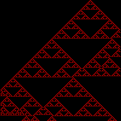

# cellular-automata (August 2017)

Simple program that generates a png of a cellular automata pattern.

Only works on Linux

Requires libsfml-dev (debian-based systems)

Just run "run.sh" and output.png should be generated

